# Technical Design Document Template

<!--
============================================================
TEMPLATE INSTRUCTIONS (DO NOT COPY TO OUTPUT DOCUMENT)
============================================================
The following guidelines are for reference only.
DO NOT include this section in the generated document.
============================================================
-->

<!--
**Document Guidelines**:
- This is a **design document**, not implementation code
- Focus on **what to change**, not **how to write code**
- **Conditional Sections**: Only include sections relevant to your changes

**Mermaid Syntax Requirements (Target version: 9.1.x)**:
- All diagrams use Mermaid (`graph TD`, `sequenceDiagram`, `erDiagram`, `stateDiagram-v2`)
- Node text must use double quotes: `A["Text"]` instead of `A[Text]`
- Arrow types: Only use `-->` (solid), `-.->` (dashed), `==>` (thick)
- Arrow labels must be simple: `A -->|Label| B` (letters, numbers, spaces, basic punctuation only)
- ER diagram decimal type: Use `decimal` without parameters
- Subgraph syntax: `subgraph Title` instead of `subgraph Name[Text]`
-->

<!--
============================================================
ACTUAL DOCUMENT CONTENT STARTS HERE
============================================================
-->

> Generated by [**TTADK**](https://bytedance.larkoffice.com/wiki/Gw0ewxEbHi1K0NkVd2YcNwvVnTg) (TikTok AI-Driven Development Kit)


## 1. Business Background

**Objective**: [One sentence describing the core goal]

**Measurable Targets**:
- [Target 1]
- [Target 2]

---

## 2. Requirement Analysis

### 2.1 Current Status

[Brief description of the current system state]

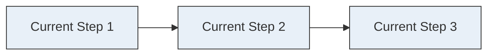

### 2.2 Business Goals

1. **[Goal 1]**: [Description]
2. **[Goal 2]**: [Description]

### 2.3 Feature Module Division

| Feature Module | Feature Points | Change Type | Dependencies |
|:---------------|:---------------|:------------|:-------------|
| [Module Name] | [Feature description] | New | [Service/None] |
| | [Another feature] | Modified | [Service] |
| [Module Name] | [Feature description] | New | [Service] |

### 2.4 Use Case Diagram (Optional)

**Roles**:
- **User**: [Actions: submit, view, query, etc.]
- **Admin**: [Actions: configure, manage, etc.]

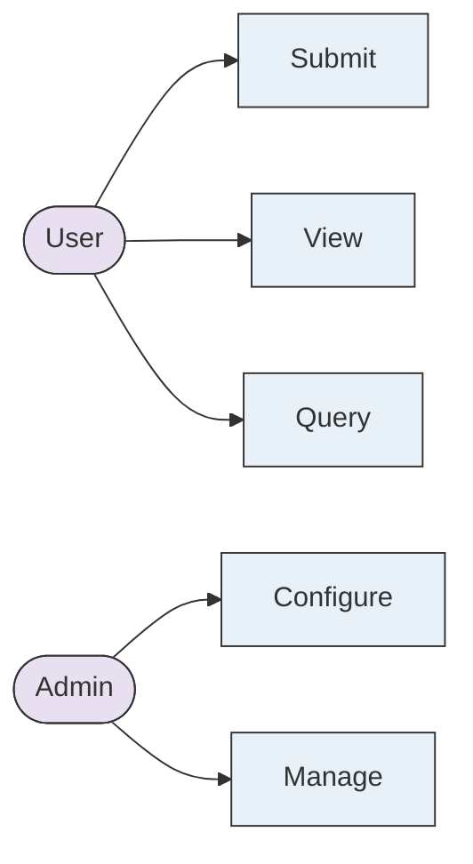

---

## 3. System Design

### 3.1 Network Topology

> Use Mermaid flowchart LR for network topology with layered design

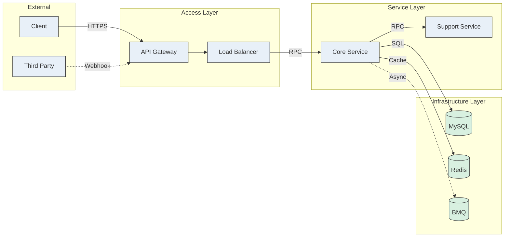

### 3.2 Overall Architecture Diagram

> Use flowchart LR for overall architecture, highlight changed modules in red

<!--
Architecture diagram principles:
- Structure: Use subgraph for layers (Access/Business/Infrastructure), max 5 nodes per layer
- Visual: Different node types use different shapes (external[], service[[]], database[()], queue{{}})
- Colors: Blue=entry, Green=core, Orange=storage, Red=changed/risk
- Arrows: Main path solid-->, secondary path dashed-.->, label protocols (HTTP/RPC/SQL)
- Complexity: Split diagram if nodes>12 or lines>20
-->

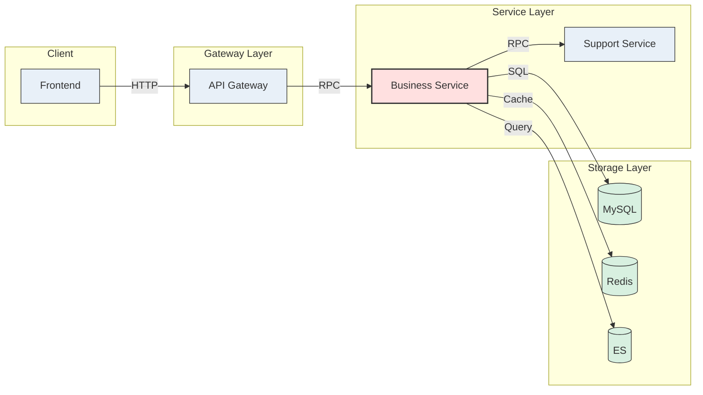

> Red nodes indicate modules affected by this change

### 3.3 Data Synchronization (If applicable)

[Describe data sync strategy between systems]

| Source | Target | Sync Method | Frequency |
|:-------|:-------|:------------|:----------|
| [System A] | [System B] | [MQ/API/CDC] | [Real-time/Batch] |

### 3.4 Domain Model / ER Diagram (If applicable)

> Include: Core entities, relationships, changed tables/fields
> Table columns should be concise to display in single line on Lark

<!--
============================================================
ER DIAGRAM SYNTAX RULES (CRITICAL - Reference Only)
============================================================

**Relationship Format** (MUST follow exactly):
```
ENTITY1 SYMBOL ENTITY2 : "label"
```
- Colon `:` is REQUIRED before the label
- Label MUST be in double quotes
- NO spaces in entity names

**Valid Relationship Symbols** (left-to-right ONLY):
- ||--||  : One-to-One (exactly one on both sides)
- ||--o|  : One-to-Zero-or-One (one required, other optional)
- ||--o{  : One-to-Many (one required, zero or more on many side)
- ||--|{  : One-to-Many (one required, at least one on many side)
- }o--o{  : Many-to-Many (both sides optional)
- }|--|{  : Many-to-Many (both sides required)

**Symbol Breakdown**:
- ||  = Exactly one (required)
- o|  = Zero or one (optional single)
- |{  = One or more (required multiple)
- o{  = Zero or more (optional multiple)

**Attribute Format**:
```
type name "comment"
```
- Comment MUST be in double quotes
- Keep comments under 20 chars for Lark display

**Common Mistakes to AVOID**:
- ❌ `USER ||--o{ ORDER` (missing label) → ✅ `USER ||--o{ ORDER : "places"`
- ❌ `{o--||` (wrong direction) → ✅ `||--o{`
- ❌ `decimal(10,2)` → ✅ `decimal`
- ❌ `varchar(255)` → ✅ `string`
- ❌ `Order Item` (space in name) → ✅ `ORDER_ITEM`
============================================================
-->

**Database Tables Example**:

<!--
ER diagram principles:
- Relationship symbols: ||=exactly one, o|=zero or one, |{=one or more, o{=zero or more
- Keep field comments concise, under 20 characters
- Highlight relationships between tables
- ALWAYS include relationship label after colon
-->

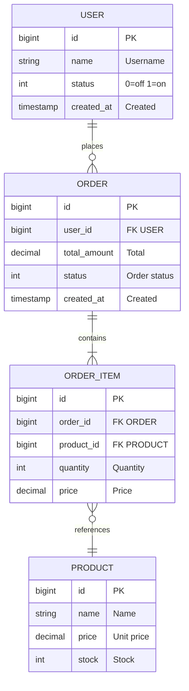

**Class/Object Relationships Example** (for C++/Java/non-DB scenarios):

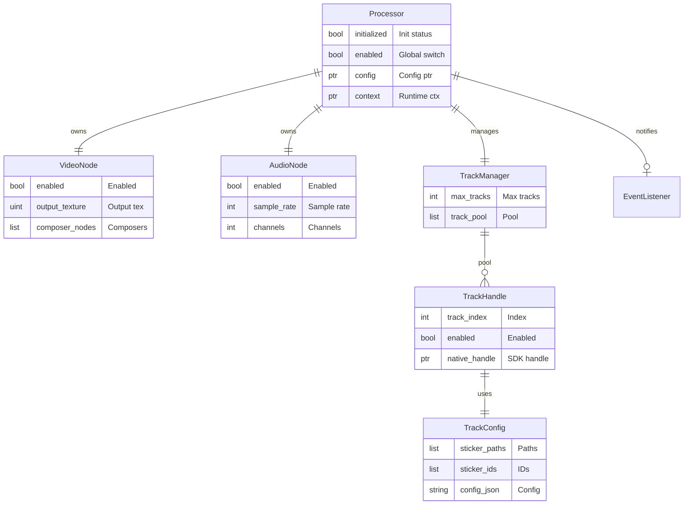

**Relationship Writing Rules** (CRITICAL):

1. **Always write from LEFT to RIGHT**: `LeftEntity ||--o{ RightEntity : "label"`
2. **Colon and label are REQUIRED**: Every relationship MUST have `: "label"` at the end
3. **Left side symbols**: `||` (exactly one) or `}o` (zero or more) or `}|` (one or more)
4. **Right side symbols**: `||` (exactly one) or `o|` (zero or one) or `o{` (zero or more) or `|{` (one or more)
5. **Read as**: "LeftEntity [has] RightEntity"

**Relationship Examples**:

| Scenario | Correct Syntax | How to Read |
|:---------|:---------------|:------------|
| One-to-One | `USER \|\|--\|\| PROFILE : "has"` | User has exactly one Profile |
| One-to-ZeroOrOne | `USER \|\|--o\| AVATAR : "has"` | User has zero or one Avatar |
| One-to-Many | `USER \|\|--o{ ORDER : "places"` | User has zero or more Orders |
| One-to-AtLeastOne | `ORDER \|\|--\|{ ORDER_ITEM : "contains"` | Order has one or more OrderItems |
| Many-to-Many | `USER }o--o{ ROLE : "assigned"` | Users and Roles (many-to-many) |

### 3.5 Schema Definitions

> Only include subsections relevant to your changes

#### 3.5.1 Database Tables (If DB changes involved)

##### [Table Name]

| Property | Value |
|:---------|:------|
| **Table Name** | table_name |
| **Description** | [Table purpose] |
| **Data Estimate** | [Volume estimate] |
| **Idempotency** | [Yes/No] |
| **Change Impact** | [Migration needed?] |

**DDL**:
```sql
CREATE TABLE `table_name` (
  `id` bigint unsigned NOT NULL AUTO_INCREMENT COMMENT 'PK',
  `name` varchar(255) NOT NULL COMMENT 'Name',
  `status` int NOT NULL DEFAULT '0' COMMENT 'Status',
  `created_at` timestamp NOT NULL DEFAULT CURRENT_TIMESTAMP,
  `updated_at` timestamp NOT NULL DEFAULT CURRENT_TIMESTAMP ON UPDATE CURRENT_TIMESTAMP,
  PRIMARY KEY (`id`),
  KEY `idx_status` (`status`)
) ENGINE=InnoDB DEFAULT CHARSET=utf8mb4;
```

#### 3.5.2 Elasticsearch Index (If ES changes involved)

##### [Index Name]

| Property | Value |
|:---------|:------|
| **Index Name** | index_name |
| **Description** | [Purpose] |
| **Shards** | [Number] |
| **Replicas** | [Number] |

**Mapping**:
```json
{
  "mappings": {
    "properties": {
      "id": { "type": "keyword" },
      "name": { "type": "text" },
      "created_at": { "type": "date" }
    }
  }
}
```

#### 3.5.3 Cache Structure (If cache involved)

##### [Cache Name]

| Property | Value |
|:---------|:------|
| **Key Pattern** | `prefix:{id}` |
| **Type** | String/Hash/List/Set |
| **TTL** | [Duration] |
| **Purpose** | [Cache purpose] |

**Value Example**:
```json
{
  "id": "123",
  "data": "value"
}
```

#### 3.5.4 MQ Messages (If MQ involved)

##### [Message Name]

| Property | Value |
|:---------|:------|
| **Topic** | topic.name |
| **Purpose** | [Message purpose] |
| **Format** | JSON |
| **Consumer** | [Service name] |
| **Idempotency** | [How handled] |
| **QPS** | [Expected volume] |

**Message Structure**:
```go
type MessageName struct {
    ID        string `json:"id"`
    Type      string `json:"type"`
    Payload   Data   `json:"payload"`
    Timestamp int64  `json:"timestamp"`
}
```

#### 3.5.5 Configuration (If TCC/Config involved)

| Config Key | Type | Default | Example | Purpose |
|:-----------|:-----|:--------|:--------|:--------|
| `config.key` | JSON | `{}` | `{"enabled": true}` | [Purpose] |

---

## 4. Core Changes

> For each interface or change point:
> - **Flowchart** → **Sequence Diagram** → **Field Change Table**
> - Combine all flows (main, branch, exception, async) into ONE comprehensive flowchart
> - **Language**: Use ONLY ONE language throughout (zh or en based on preferred_language setting)

### 4.1 [Interface/Change Name]

**Flowchart**

<!--
Flowchart design principles:
- Structure: flowchart LR (left-to-right), divide into phases (Entry→Process→Storage→Return)
- Nodes: start/end([]), process step[], core module[[]], decision{}, storage[()], queue{{}}
- Colors: Blue=entry, Green=core, Orange=storage, Red=error
- Arrows: Main path solid-->, error path dashed-.->, label branches Yes/No
- Complexity: nodes≤12, lines≤20, steps per phase≤5
-->

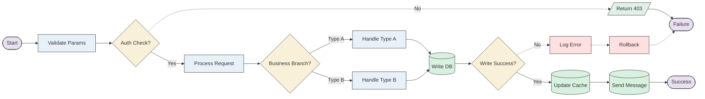

> Red nodes indicate error handling paths, dashed lines indicate exception flows

**Sequence Diagram**

<!--
Sequence diagram design principles:
- Use autonumber for automatic numbering
- Arrange participants by call order: External→Gateway→Service→Storage
- Label arrow with protocol type (HTTP/RPC/SQL/Redis)
- Use alt/else for branch scenarios
-->

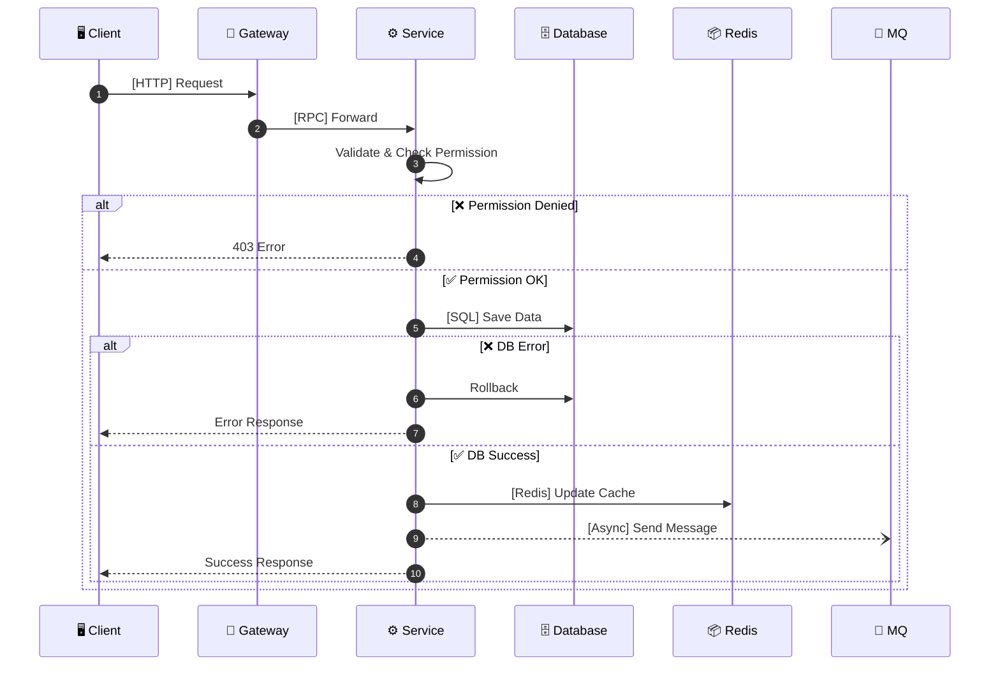

**Field Changes**

| Field | Operation | Logic |
|:------|:----------|:------|
| field_a | Read | Query from table_x by id |
| field_b | Write | Update status to 1 |
| field_c | Read/Write | Read from cache, write to DB if miss |

### 4.2 [Another Interface/Change Name]

**Flowchart**

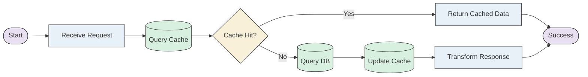

**Sequence Diagram**

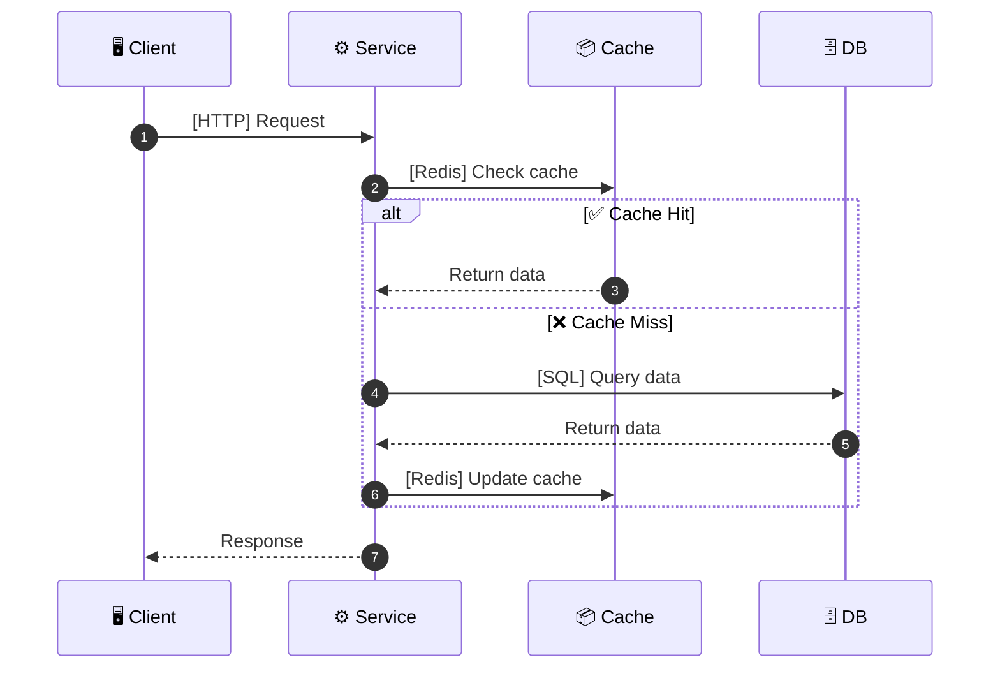

**Field Changes**

| Field | Operation | Logic |
|:------|:----------|:------|
| user_id | Read | Get from request |
| data | Write | Save to DB |

### 4.3 [Async Consumer Name] (If async flow exists)

**Flowchart**

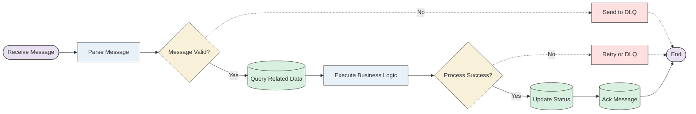

**Sequence Diagram**

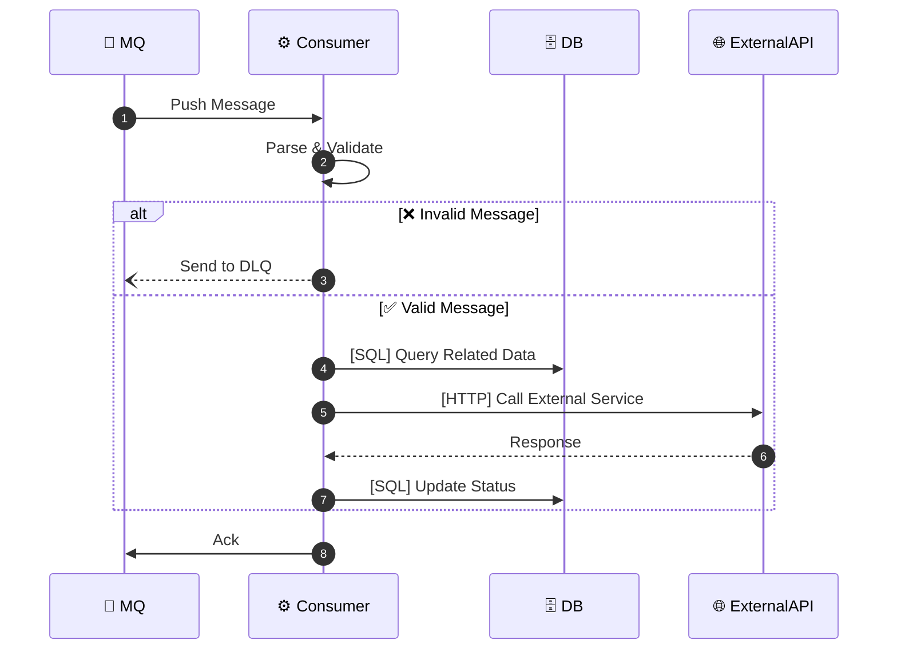

**Field Changes**

| Field | Operation | Logic |
|:------|:----------|:------|
| message_id | Read | From MQ message |
| status | Write | Update after processing |

### 4.4 State Diagram (If applicable)

> Include: Initial state, intermediate states, terminal states, exception paths

<!--
State diagram design principles:
- Use direction LR for horizontal layout
- Group states: Initial→Intermediate→Terminal
- Use emoji to mark state types
- Use note to explain exception handling
-->

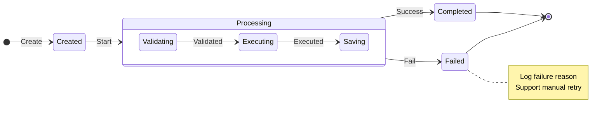

### 4.5 Interface Definitions (If applicable)

> Format: PSM + Method, request/response body (no tables), separator after each interface

#### service.psm.name / MethodName

**Request**:
```thrift
struct RequestName {
    1: required string field1    // Field description
    2: optional int64 field2     // Field description
    255: base.Base Base
}
```

**Response**:
```thrift
struct ResponseName {
    1: int32 code               // Response code
    2: string message           // Response message
    3: DataType data            // Response data
    255: base.BaseResp BaseResp
}
```

---

#### service.psm.name / AnotherMethod

**Request**:
```thrift
struct AnotherRequest {
    1: required int64 id
    255: base.Base Base
}
```

**Response**:
```thrift
struct AnotherResponse {
    1: int32 code
    2: string message
    255: base.BaseResp BaseResp
}
```

---

## 5. Checklist

> DDL changes and resource application tasks only

- [ ] [DDL task: Create/alter table xxx]
- [ ] [DDL task: Add index on table xxx]
- [ ] [Resource: Apply for Redis cluster]
- [ ] [Resource: Apply for MQ topic]
- [ ] [Resource: Apply for ES index]
