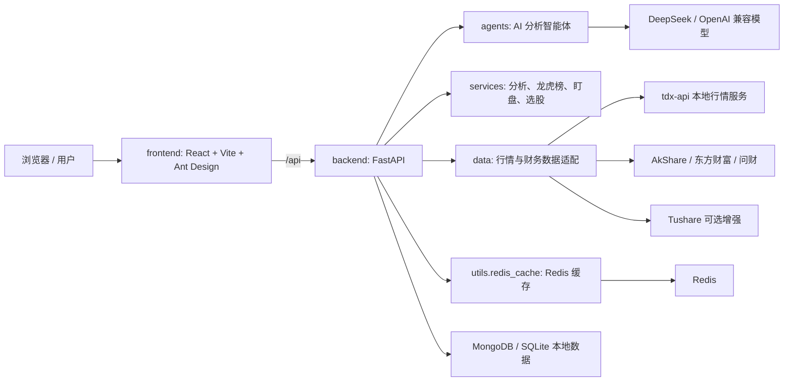

# AI Agents Stock

面向 A 股投研场景的多智能体股票分析与盯盘系统。当前工程采用 **React + FastAPI** 前后端分离架构，集成本地 `tdx-api`、Redis 缓存、MongoDB 持久化、DeepSeek/OpenAI 兼容大模型，以及 AkShare、Tushare、东方财富等多数据源兜底链路。

> 风险提示：本项目输出仅用于研究、复盘和辅助决策，不构成任何投资建议。证券市场有风险，交易决策需自行承担。

## 功能概览

| 模块 | 核心能力 |
| --- | --- |
| 股票分析 | 技术面、基本面、AI 深度分析、综合分析、批量分析、历史报告 |
| 价格预测 | 基于日 K、ATR、布林带、MA20、关键高低点、放量验证、多次测试、涨跌停规则进行未来 480 分钟压力/支撑与振幅估算 |
| 分析设置 | 页面支持勾选分析维度，后端只执行被勾选的分析项，减少无效请求与等待时间 |
| 选股策略 | 价值投资选股、主力资金选股等策略入口 |
| 龙虎榜 | 龙虎榜数据获取、AI 解读、报告落库、历史报告、统计分析 |
| 智能盯盘 | 监控配置、股票池管理、触发规则、通知记录、自动通知、交易时段控制 |
| 数据稳定性 | Redis 按数据类型缓存，源数据异常时支持 stale 缓存兜底，降低外部接口波动影响 |
| 本地行情 | `tdx-api` 已迁移到本项目内，可与后端统一部署、维护和健康检查 |

## 系统架构



### 分层说明

- `frontend`：React 单页应用，承载股票分析、龙虎榜、选股、智能盯盘等页面。
- `backend/api/v1`：FastAPI 路由层，对前端提供统一 REST API。
- `backend/services`：业务服务层，负责综合分析、价格预测、龙虎榜、盯盘等核心流程。
- `backend/data`：数据源适配层，封装行情、财务、资金流、新闻等数据获取。
- `backend/agents`：AI 智能体与报告生成逻辑。
- `backend/db`：历史报告、龙虎榜报告、盯盘股票与通知等持久化。
- `backend/utils`：日志、缓存、PDF、通用工具。
- `tdx-api`：本地通达信行情服务，作为实时行情与 K 线数据的重要来源。

## 目录结构

```text
aiagents-stock/
├── backend/
│   ├── main.py                 # FastAPI 应用入口
│   ├── api/v1/                 # REST API 路由
│   ├── agents/                 # AI 分析智能体
│   ├── core/                   # 全局配置
│   ├── data/                   # 数据源适配
│   ├── db/                     # 持久化访问
│   ├── schemas/                # Pydantic 请求/响应模型
│   ├── services/               # 业务服务
│   ├── strategies/             # 选股与交易策略
│   ├── utils/                  # 日志、缓存、PDF 等工具
│   └── websocket/              # WebSocket 相关能力
├── frontend/
│   ├── src/
│   │   ├── pages/              # 页面模块
│   │   ├── services/           # 前端 API 封装
│   │   ├── types/              # TypeScript 类型
│   │   └── components/         # 通用组件
│   ├── Dockerfile
│   └── nginx.conf
├── tdx-api/                    # 本地行情服务，Go 实现
├── data/                       # 本地数据文件
├── db/                         # 本地数据库文件
├── log/                        # 应用日志
├── tests/                      # 测试与验证脚本
├── .env.example                # 环境变量模板
└── docker-compose.yml          # 一键编排后端、前端、Redis、tdx-api
```

## 服务与端口

| 服务 | 默认端口 | 说明 |
| --- | ---: | --- |
| 前端 Docker/Nginx | `3000` | 生产模式前端入口 |
| 前端本地开发 Vite | `5173` | 本地开发热更新 |
| 后端 FastAPI | `8000` | API、Swagger、健康检查 |
| tdx-api | `8080` | 本地行情 API |
| Redis | `6379` | 缓存与源数据异常兜底 |
| MongoDB | `27017` | 报告与业务数据持久化，Docker Compose 默认内置 |

## 快速部署

推荐使用部署脚本统一启动前端、后端、MongoDB、Redis 与 `tdx-api`。

### 1. 准备配置

```bash
cp .env.example .env
```

至少需要配置：

```env
DEEPSEEK_API_KEY=你的模型 API Key
DEEPSEEK_BASE_URL=https://api.deepseek.com/v1
DEFAULT_MODEL_NAME=deepseek-chat
DEEPSEEK_THINKING_ENABLED=false
DEEPSEEK_REASONING_EFFORT=high
DEEPSEEK_THINKING_TYPE=enabled
MONGODB_URI=mongodb://localhost:27017/
MONGODB_DB_NAME=aiagents_stock
```

Docker Compose 部署时，后端会优先使用 `DOCKER_MONGODB_URI=mongodb://mongo:27017/`、`DOCKER_REDIS_URL=redis://redis:6379/0`、`DOCKER_TDX_BASE_URL=http://tdx-api:8080` 这组三个容器内地址，避免 `.env` 中的本地 `localhost` 在容器内指向错误位置。

### 2. 启动服务

```bash
./deploy.sh
```

### 3. 验证服务

```bash
./deploy.sh status
./deploy.sh health
```

访问入口：

- 前端页面：http://127.0.0.1:3000
- 后端文档：http://127.0.0.1:8000/docs
- 后端健康检查：http://127.0.0.1:8000/health
- tdx-api 健康检查：http://127.0.0.1:8080/api/health

## 本地开发

### 后端

要求 Python 3.11+。

```bash
python3 -m venv venv
source venv/bin/activate
pip install -r backend/requirements.txt
PYTHONPATH=backend ./venv/bin/python -m uvicorn backend.main:app --host 127.0.0.1 --port 8000 --reload
```

后端启动后：

```bash
curl http://127.0.0.1:8000/health
```

### 前端

要求 Node.js 18+。

```bash
cd frontend
npm install
npm run dev -- --host 127.0.0.1
```

本地开发访问：http://127.0.0.1:5173

### tdx-api

要求 Go 1.22+。如果不使用 Docker Compose，可单独启动本地行情服务：

```bash
cd tdx-api
go run .
```

默认健康检查：http://127.0.0.1:8080/api/health

### Redis

本地开发建议启动 Redis，用于缓存行情、财务、资金流、龙虎榜、价格预测等数据：

```bash
docker run -d --name aiagents-stock-redis -p 6379:6379 redis:7-alpine
```

或者使用系统已安装的 Redis：

```bash
redis-server
```

## 环境变量

| 变量 | 默认值 | 说明 |
| --- | --- | --- |
| `DEEPSEEK_API_KEY` | 空 | AI 分析必填，DeepSeek 或兼容服务 Key |
| `DEEPSEEK_BASE_URL` | `https://api.deepseek.com/v1` | OpenAI 兼容接口地址 |
| `DEFAULT_MODEL_NAME` | `deepseek-chat` | 默认大模型名称 |
| `DEEPSEEK_THINKING_ENABLED` | `false` | 是否为 DeepSeek 兼容调用开启 thinking 思考模式 |
| `DEEPSEEK_REASONING_EFFORT` | `high` | 思考强度，支持 `low`、`medium`、`high` |
| `DEEPSEEK_THINKING_TYPE` | `enabled` | 传给 `extra_body.thinking.type` 的值 |
| `TUSHARE_TOKEN` | 空 | 可选，用于增强财务、上市日期等数据 |
| `MONGODB_URI` | `mongodb://localhost:27017/` | 本地开发 MongoDB 地址 |
| `MONGODB_DB_NAME` | `aiagents_stock` | MongoDB 数据库名 |
| `REDIS_ENABLED` | `true` | 是否启用 Redis 缓存 |
| `REDIS_URL` | `redis://127.0.0.1:6379/0` | 本地开发 Redis 地址 |
| `REDIS_KEY_PREFIX` | `aiagents-stock` | Redis Key 前缀 |
| `TDX_ENABLED` | `true` | 是否启用本地 tdx-api |
| `TDX_BASE_URL` | `http://127.0.0.1:8080` | 本地开发 tdx-api 地址 |
| `DOCKER_MONGODB_URI` | `mongodb://mongo:27017/` | Docker Compose 后端连接 MongoDB 地址 |
| `DOCKER_REDIS_URL` | `redis://redis:6379/0` | Docker Compose 后端连接 Redis 地址 |
| `DOCKER_TDX_BASE_URL` | `http://tdx-api:8080` | Docker Compose 后端连接 tdx-api 地址 |
| `FRONTEND_PORT` | `3000` | Docker 前端宿主机端口 |
| `BACKEND_PORT` | `8000` | Docker 后端宿主机端口 |
| `TDX_PORT` | `8080` | Docker tdx-api 宿主机端口 |
| `REDIS_PORT` | `6379` | Docker Redis 宿主机端口 |
| `MONGO_PORT` | `27017` | Docker MongoDB 宿主机端口 |
| `PIP_INDEX_URL` | `https://pypi.tuna.tsinghua.edu.cn/simple` | Docker 构建后端镜像时使用的 Python 包镜像源 |
| `EMAIL_ENABLED` | `false` | 是否启用邮件通知 |
| `WEBHOOK_ENABLED` | `false` | 是否启用钉钉/飞书 Webhook |
| `MINIQMT_ENABLED` | `false` | 是否启用 MiniQMT 交易接口 |
| `TZ` | `Asia/Shanghai` | 服务时区 |

缓存 TTL 可通过 `.env` 覆盖，常用项：

| 变量 | 默认值 | 数据类型 |
| --- | ---: | --- |
| `CACHE_TTL_REALTIME_SECONDS` | `30` | 实时行情 |
| `CACHE_TTL_TECHNICAL_SECONDS` | `1800` | 技术指标 |
| `CACHE_TTL_KLINE_SECONDS` | `1800` | K 线 |
| `CACHE_TTL_FUNDAMENTAL_SECONDS` | `43200` | 基本面 |
| `CACHE_TTL_FUND_FLOW_SECONDS` | `1800` | 资金流 |
| `CACHE_TTL_NEWS_SECONDS` | `1800` | 新闻 |
| `CACHE_TTL_LONGHUBANG_SECONDS` | `86400` | 龙虎榜 |
| `CACHE_TTL_PRICE_PREDICTION_SECONDS` | `300` | 价格预测 |

每类数据还配置了 `CACHE_STALE_TTL_*`。当源数据请求失败时，后端可在 stale 时间窗口内返回旧缓存，提升系统稳定性。

## 数据链路

### 行情与技术数据

优先使用本项目内置的 `tdx-api` 获取实时行情与 K 线数据；当本地服务不可用或数据不足时，后端会根据具体模块尝试 AkShare、东方财富、Tushare 等数据源兜底。

### 基本面数据

基本面接口会尽量获取 PE、PB、市值、营收、利润、股息率、负债率等字段。受数据源权限、股票类型、披露周期影响，部分字段可能为空；Redis 会缓存已成功获取的数据，避免每次都重新请求源站。

### 龙虎榜数据

龙虎榜模块会按指定日期或日期范围抓取公开龙虎榜数据，并生成 AI 解读报告。若返回“未获取到龙虎榜数据”，通常表示该交易日无公开龙虎榜记录、源站响应异常，或日期不是交易日。

### 价格预测数据

价格预测依赖至少 30 根日 K，并结合当前价、ATR14、MA20、布林带、放量、多次测试、近 7 日天量、箱体边界、涨跌停限制和上市日期特殊规则。当前已接入常规 A 股涨跌幅限制，新股上市前几日不设涨跌幅的场景会结合上市日期判断。

## API 快速参考

基础地址：

```text
http://127.0.0.1:8000/api/v1
```

| 模块 | 方法 | 路径 | 说明 |
| --- | --- | --- | --- |
| 健康检查 | GET | `/health` | 后端服务健康状态 |
| 技术分析 | POST | `/api/v1/analysis/technical` | 单股技术面分析 |
| 基本面分析 | POST | `/api/v1/analysis/fundamental` | 单股基本面分析 |
| 价格预测 | POST | `/api/v1/analysis/price-prediction` | 压力/支撑/振幅预测 |
| 综合分析 | POST | `/api/v1/analysis/comprehensive` | 多维度结构化分析 |
| AI 深度分析 | POST | `/api/v1/analysis/ai` | 生成 AI 投研报告 |
| 批量 AI 分析 | POST | `/api/v1/analysis/batch-ai` | 多股票批量报告 |
| 分析历史 | GET | `/api/v1/analysis/history` | 查询历史报告 |
| 价值选股 | POST | `/api/v1/stock/value` | 价值投资策略选股 |
| 主力选股 | POST | `/api/v1/stock/main-force` | 主力资金策略选股 |
| 龙虎榜分析 | POST | `/api/v1/longhubang/analyze` | 抓取并分析龙虎榜 |
| 龙虎榜报告 | GET | `/api/v1/longhubang/reports` | 报告列表 |
| 龙虎榜统计 | GET | `/api/v1/longhubang/statistics` | 统计概览 |
| 盯盘配置 | GET/PUT | `/api/v1/monitor/config` | 获取或更新盯盘配置 |
| 盯盘股票 | GET/POST | `/api/v1/monitor/stocks` | 查询或新增监控股票 |
| 通知记录 | GET/DELETE | `/api/v1/monitor/notifications` | 查询或清空通知 |

### 常用请求示例

价格预测：

```bash
curl -X POST http://127.0.0.1:8000/api/v1/analysis/price-prediction \
  -H "Content-Type: application/json" \
  -d '{"symbol":"002812"}'
```

只按指定维度做综合分析：

```bash
curl -X POST http://127.0.0.1:8000/api/v1/analysis/comprehensive \
  -H "Content-Type: application/json" \
  -d '{"symbol":"002812","days_ago":60,"analysis_dimensions":["technical","fundamental","price_prediction"]}'
```

龙虎榜分析：

```bash
curl -X POST http://127.0.0.1:8000/api/v1/longhubang/analyze \
  -H "Content-Type: application/json" \
  -d '{"analysis_mode":"指定日期","date":"2026-04-24","days":1}'
```

开启智能盯盘：

```bash
curl -X PUT http://127.0.0.1:8000/api/v1/monitor/config \
  -H "Content-Type: application/json" \
  -d '{"monitor_enabled":true,"check_interval":300,"auto_notification":true}'
```

## 页面入口

| 页面 | 路由 | 说明 |
| --- | --- | --- |
| 首页 | `/` | 系统概览 |
| 股票分析 | `/analysis` | 分析维度勾选、单股分析、AI 报告 |
| 分析历史 | `/analysis/history` | 历史分析报告 |
| 价值选股 | `/stock/value` | 价值投资策略 |
| 主力选股 | `/stock/main-force` | 主力资金策略 |
| 龙虎榜分析 | `/longhubang/analysis` | 龙虎榜抓取与报告生成 |
| 龙虎榜历史 | `/longhubang/history` | 龙虎榜报告查询 |
| 龙虎榜统计 | `/longhubang/statistics` | 龙虎榜统计 |
| 盯盘股票 | `/monitor/stocks` | 监控股票池 |
| 盯盘配置 | `/monitor/config` | 扫描间隔、通知配置 |
| 通知记录 | `/monitor/notifications` | 触发记录与通知历史 |

## 验证与运维

### 后端基础验证

```bash
PYTHONPATH=backend ./venv/bin/python -m py_compile backend/main.py
curl http://127.0.0.1:8000/health
```

### 前端构建验证

```bash
cd frontend
npm run build
```

### Docker 日志

```bash
./deploy.sh logs backend
./deploy.sh logs frontend
./deploy.sh logs mongo
./deploy.sh logs redis
./deploy.sh logs tdx-api
```

### 端口占用排查

```bash
lsof -nP -iTCP:8000 -sTCP:LISTEN
lsof -nP -iTCP:3000 -sTCP:LISTEN
lsof -nP -iTCP:5173 -sTCP:LISTEN
lsof -nP -iTCP:8080 -sTCP:LISTEN
```

## 故障排查

### 后端服务未启动

1. 检查 `.env` 是否存在且包含必要配置。
2. 检查依赖是否安装完整：`pip install -r backend/requirements.txt`。
3. 使用 `PYTHONPATH=backend` 启动，避免包导入失败。
4. 查看 `log/app.log` 或 `./deploy.sh logs backend`。

### 前端无法访问后端

1. 本地开发确认后端运行在 `http://127.0.0.1:8000`。
2. Docker 部署确认 nginx 已代理 `/api` 到 `backend:8000`。
3. 检查浏览器控制台和后端日志中的 CORS 或 500 错误。

### Redis 连接失败

1. 确认 Redis 已启动：`./deploy.sh status`。
2. 本地开发确认 `REDIS_URL=redis://127.0.0.1:6379/0`。
3. Docker 内部确认使用 `DOCKER_REDIS_URL=redis://redis:6379/0`。
4. Redis 不可用时系统仍可请求源数据，但稳定性和响应速度会下降。

### MongoDB 连接失败

1. 确认 MongoDB 容器已启动：`./deploy.sh status`。
2. 本地开发确认 `MONGODB_URI=mongodb://localhost:27017/`。
3. Docker 内部确认使用 `DOCKER_MONGODB_URI=mongodb://mongo:27017/`。
4. 如需连接外部 MongoDB，修改 `.env` 中的 `DOCKER_MONGODB_URI` 后执行 `./deploy.sh restart`。

### tdx-api 不可用

1. 检查健康接口：`curl http://127.0.0.1:8080/api/health`。
2. Docker 部署确认后端环境变量为 `DOCKER_TDX_BASE_URL=http://tdx-api:8080`。
3. 本地开发确认 `.env` 为 `TDX_BASE_URL=http://127.0.0.1:8080`。
4. 如果 tdx-api 数据不足，后端会尝试其他数据源，但实时性可能下降。

### 龙虎榜提示未获取到数据

1. 确认查询日期是交易日。
2. 确认该日确实存在公开龙虎榜记录。
3. 检查东方财富、问财等数据源是否被限流或返回空数据。
4. 查看 Redis 是否存在旧缓存，必要时调整查询日期或稍后重试。

### AI 报告日期或署名异常

当前报告生成逻辑会注入当天日期和系统署名。如果仍出现旧日期或占位署名，优先检查后端是否已重启，以及正在访问的是否为最新后端进程。

### 价格预测结果不合理

1. 确认股票代码正确，并能获取至少 30 根日 K。
2. 检查当前价是否来自最近 5 分钟 K 线或有效收盘价。
3. 检查上市日期、涨跌停规则、ST/创业板/科创板等限制是否被识别。
4. 查看返回中的压力位、支撑位、涨跌幅是否被涨跌停边界修正。

## 安全与合规

- 不要提交 `.env`、API Key、数据库密码、Webhook 地址等敏感信息。
- 建议生产环境使用反向代理、HTTPS、访问鉴权和防火墙限制。
- 所有 AI 结论都需要人工复核，不应直接作为自动交易依据。
- 如启用 MiniQMT 或其他交易接口，请先在模拟环境验证完整风控链路。

## 开发建议

- 后端新增接口时同步补充 `backend/schemas` 请求/响应模型。
- 涉及数据源的改动优先接入 Redis 缓存，按数据类型设置合理 TTL。
- 涉及页面的改动同步更新 `frontend/src/types` 与对应 `services` 封装。
- 涉及 AI 报告的改动需验证报告日期、署名、Markdown 渲染和异常兜底。
- 涉及盯盘的改动需覆盖启动/停止、交易时段、触发规则、通知落库四类场景。

## 许可证

请结合原项目授权与当前仓库约定使用。本项目代码和报告能力仅供学习研究，不承担任何投资收益或损失责任。
